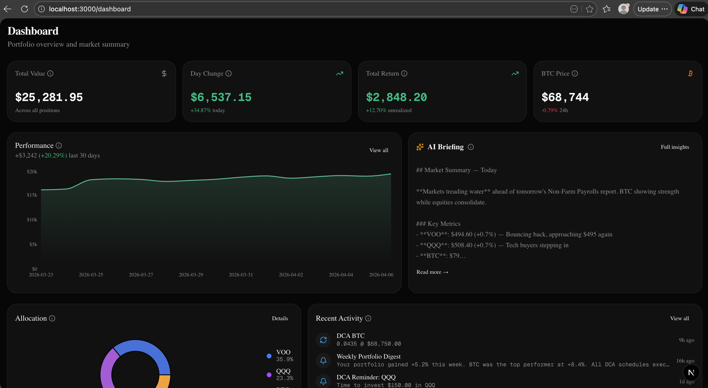
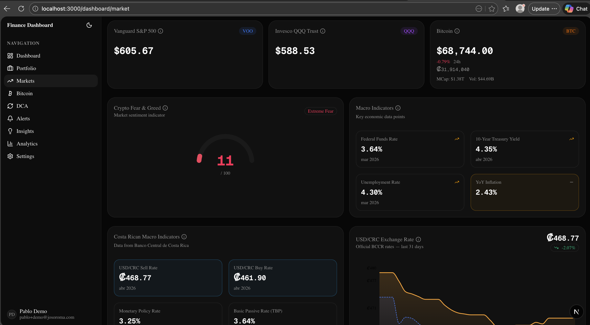

# Finance Dashboard

> Personal finance command center for a self-directed VOO / QQQ / Bitcoin investor based in Costa Rica.

Built with Next.js 15 (App Router), TypeScript strict, Tailwind CSS v4, shadcn/ui, Supabase, Vercel AI SDK, and Recharts.





---

## Table of Contents

- [Who It's For](#who-its-for)
- [SPECS-Driven Development](#specs-driven-development)
- [Project Structure](#project-structure)
- [Setup & Run](#setup--run)
- [Cron Jobs](#cron-jobs)
- [Demo Data](#demo-data)
- [Documentation Index](#documentation-index)
- [Commands](#commands)

---

## Who It's For

A software developer living in Costa Rica who:

- Invests internationally through Interactive Brokers (ETFs) and a crypto exchange (Bitcoin)
- Follows a **DCA discipline** — weekly/monthly recurring buys regardless of price
- Has a **10+ year time horizon** with medium-high risk tolerance
- Wants **signal, not noise** — 15 minutes per day maximum for market review
- Operates under Costa Rica's **territorial tax system** — foreign investment gains are generally tax-exempt

The dashboard tracks a focused three-asset portfolio with a target allocation of 50% VOO, 20% QQQ, 20% BTC, and 10% cash. It replaces the daily ritual of checking five different apps with a single, AI-augmented command center.

---

## SPECS-Driven Development

This project follows a structured, document-first workflow where every line of code traces back to a specification. The chain works like this:

### 1. Product Design Document → `README-PRODUCT-DESIGN-DOCUMENT.md`

An LLM conversation with the "product owner" generated a comprehensive product design document covering the domain model, feature map, user workflows, data sources, visual design, and technical architecture. This is the **"what and why"** of the product.

### 2. SPECS.md → Epics, User Stories & Tasks

The product design document was then transformed (also via LLM conversation) into a structured `SPECS.md` file with:

- **14 Epics** (E1–E14) — each mapping to a route group or domain
- **User Stories** (US-X.Y) — each with Gherkin acceptance criteria
- **Tasks** (T-X.Y.Z) — each mapping to specific files within a route segment
- **Status markers**: `[ ]` todo, `[~]` in progress, `[x]` completed, `[!]` blocked

This is the **"what to build, in what order"** — the executable backlog.

### 3. CLAUDE.md → Coding Conventions & Architecture

The PDD and SPECS together informed `CLAUDE.md` — the project instructions file that defines:

- **Colocated feature-based architecture** — every route segment is a self-contained boundary
- **Naming conventions** — underscore-prefixed route files, kebab-case components, PascalCase exports
- **Tech stack rules** — no `any`, no `@ts-ignore`, Server Components by default
- **Testing strategy** — colocated `__tests__/`, Vitest, pure-function focus

### 4. `.claude/` — Rules, Skills & Agents

The architecture and conventions were further codified into reusable automation:

- **Rules** (7 files in `.claude/rules/`) — path-scoped instructions auto-loaded on every code edit (code-style, database, dates, design, security, specs-workflow, testing)
- **Skills** (5 workflows in `.claude/skills/`) — structured, file-modifying patterns invoked by name: `implement-item`, `frontend-design`, `add-item`, `update-specs`, `capture-prompts`
- **Agents** (4 in `.claude/agents/`) — read-only, tool-restricted assistants: `plan-item`, `review-item`, `document-feature`, `code-reviewer`
- **Hooks** — no Claude Code hooks are configured. Git hooks live in `.husky/` (`commit-msg`, `pre-commit`, `pre-push`) and enforce commit conventions and lint/tests
- **Plugins** — no Claude Code plugin manifest is configured for this repo

The result: an LLM agent can pick up any user story, plan the work, implement it following project conventions, run tests, validate Gherkin scenarios, and update the SPECS status — all driven by the document chain.

---

## Project Structure

```
├── CLAUDE.md                         # Project instructions (conventions, architecture)
├── SPECS.md                          # Epics, user stories, tasks, Gherkin criteria
├── README-PRODUCT-DESIGN-DOCUMENT.md # Product design document
├── app/
│   ├── auth/                         # E2: Login, signup, OAuth callback
│   ├── dashboard/
│   │   ├── page.tsx                  # E11: Dashboard home
│   │   ├── portfolio/                # E4: Portfolio tracker
│   │   ├── market/                   # E3: Market data
│   │   ├── dca/                      # E5: DCA automation
│   │   ├── insights/                 # E6: AI-powered insights
│   │   ├── alerts/                   # E7: Alerts & notifications
│   │   ├── bitcoin/                  # E8: On-chain analytics
│   │   ├── analytics/                # E9: Analytics & reporting
│   │   └── settings/                 # E10: Settings & data management
│   └── api/
│       ├── ai/                       # AI streaming endpoints
│       ├── cron/                     # 6 cron jobs (see below)
│       ├── market/                   # Market data API routes
│       └── db/                       # Database utilities
├── lib/
│   ├── supabase/                     # Client, server, admin, proxy helpers
│   ├── market/                       # External API integrations (5 providers)
│   ├── ai/                           # Vercel AI SDK provider, streaming, prompts
│   ├── bitcoin/                      # On-chain, valuation, halving calculations
│   ├── indicators/                   # RSI, moving averages
│   ├── notifications/                # Multi-channel dispatcher (email, Telegram)
│   └── date/                         # Centralized date utilities (Costa Rica TZ)
├── supabase/
│   ├── migrations/                   # 8 SQL migrations
│   └── seed.sql                      # Demo data (see Demo Data section)
└── .claude/
    ├── rules/                        # 7 path-scoped coding rules (auto-loaded)
    ├── skills/                       # 5 file-modifying workflow skills
    └── agents/                       # 4 read-only agents (plan, review, document, code-reviewer)
```

---

## Setup & Run

### Prerequisites

- Node.js ≥ 18.18
- Supabase CLI (`brew install supabase/tap/supabase`)
- Docker Desktop (for local Supabase)
- Ollama (optional, for local AI: `brew install ollama`)

### First Time Setup

```bash
# 1. Clone and install
git clone <repo-url> && cd finance
npm install

# 2. Copy env template and fill in API keys
cp .env.local.example .env.local
# Edit .env.local — see docs/technical/setup.md for all API key instructions

# 3. Start local Supabase (Docker must be running)
supabase start

# 4. Apply migrations + seed demo data
supabase db reset

# 5. Start dev server
npm run dev
# → http://localhost:3000
```

### Reset Database (wipe + reseed)

```bash
supabase db reset
```

This recreates the database, applies all 8 migrations, and runs `supabase/seed.sql` which populates 15 days of demo data relative to today's date.

### Regenerate Supabase Types

```bash
supabase gen types typescript --local > lib/supabase/database.types.ts
```

### Pull Ollama Model (for local AI)

```bash
ollama pull qwen3.5:9b
```

For full setup details including all API key registration links, see [docs/technical/setup.md](docs/technical/setup.md).

---

## Cron Jobs

Six cron jobs run under `app/api/cron/`, each protected by `CRON_SECRET` Bearer token.

| Cron Job             | Schedule      | Costa Rica Time | Tables Affected                                                       |
| -------------------- | ------------- | --------------- | --------------------------------------------------------------------- |
| `market-prefetch`    | `*/5 * * * *` | Every 5 min     | `market_cache` (upsert), `api_request_counts` (upsert)                |
| `alert-evaluation`   | `*/5 * * * *` | Every 5 min     | `alerts` (read/update), `notifications` (insert), `profiles` (read)   |
| `portfolio-snapshot` | `0 2 * * *`   | 8:00 PM CST     | `positions` (read), `portfolio_snapshots` (upsert)                    |
| `dca-reminders`      | `0 12 * * *`  | 6:00 AM CST     | `dca_schedules` (read), `notifications` (insert)                      |
| `ai-summary`         | `0 13 * * *`  | 7:00 AM CST     | `profiles` (read), `ai_summaries` (read/insert)                       |
| `cache-cleanup`      | `0 3 * * *`   | 9:00 PM CST     | `market_cache`, `api_request_counts`, `notifications`, `ai_summaries` |

**Local dev** — trigger manually:

```bash
export CRON_SECRET=local-dev-cron-secret

curl -s http://localhost:3000/api/cron/market-prefetch \
  -H "Authorization: Bearer $CRON_SECRET" | jq

curl -s http://localhost:3000/api/cron/ai-summary \
  -H "Authorization: Bearer $CRON_SECRET" | jq
```

For the full architecture (cache tiers, external API inventory, retention policies), see [docs/technical/cronjobs.md](docs/technical/cronjobs.md).

---

## Demo Data

The seed file (`supabase/seed.sql`) creates a fully populated demo account for stakeholder demos.

**Login**: `pablo+demo@josoroma.com` / `Demosthenes.579`

All dates are relative to `CURRENT_DATE`, so the data is always "fresh" after each `supabase db reset`.

| Data                | Count | Details                                                           |
| ------------------- | ----- | ----------------------------------------------------------------- |
| Auth user + profile | 1     | Pablo Demo, USD, Costa Rica, Medium-High risk, ollama/qwen3.5:9b  |
| Portfolio           | 1     | "Main Portfolio" with 40/30/30 target allocation (VOO/QQQ/BTC)    |
| Positions           | 3     | VOO (15 qty), QQQ (10 qty), BTC (0.15 qty)                        |
| Transactions        | 12    | Mix of Buy, DCA, and Sell across 15 days                          |
| DCA schedules       | 3     | Weekly: VOO on Mon, QQQ on Wed, BTC on Fri                        |
| Alerts              | 6     | 5 active + 1 triggered (price, RSI, MA cross, MVRV types)         |
| Portfolio snapshots | 15    | Daily snapshots with realistic price evolution                    |
| AI summaries        | 15    | Unique daily market commentary (model: ollama/qwen3.5:9b)         |
| Notifications       | 8     | Mix of alert_fired, dca_reminder, system types (some read/unread) |
| Market cache        | 4     | Pre-warmed cache for VOO, QQQ, BTC, Fear & Greed                  |

**Important**: Since dates use `CURRENT_DATE - N`, re-run `supabase db reset` if demoing on a different day to keep "today's" AI summary current.

For implementation details, see [docs/technical/demoUserSeedDemo.md](docs/technical/demoUserSeedDemo.md).

---

## Documentation Index

### Route Documentation (`docs/routes/`)

| Epic | Route                  | Doc                                                            |
| ---- | ---------------------- | -------------------------------------------------------------- |
| E2   | Authentication         | [docs/routes/authentication.md](docs/routes/authentication.md) |
| E3   | Market Data Engine     | [docs/routes/market.md](docs/routes/market.md)                 |
| E4   | Portfolio Tracker      | [docs/routes/portfolio.md](docs/routes/portfolio.md)           |
| E5   | DCA Automation         | [docs/routes/dca.md](docs/routes/dca.md)                       |
| E6   | AI-Powered Insights    | [docs/routes/insights.md](docs/routes/insights.md)             |
| E7   | Alerts & Notifications | [docs/routes/alerts.md](docs/routes/alerts.md)                 |
| E8   | Bitcoin On-Chain       | [docs/routes/bitcoin.md](docs/routes/bitcoin.md)               |
| E9   | Analytics & Reporting  | [docs/routes/analytics.md](docs/routes/analytics.md)           |
| E10  | Settings               | [docs/routes/settings.md](docs/routes/settings.md)             |
| E11  | Dashboard Home         | [docs/routes/dashboard.md](docs/routes/dashboard.md)           |

### Technical Documentation (`docs/technical/`)

| Topic                   | Doc                                                                      |
| ----------------------- | ------------------------------------------------------------------------ |
| Local Development Setup | [docs/technical/setup.md](docs/technical/setup.md)                       |
| Cron Jobs Architecture  | [docs/technical/cronjobs.md](docs/technical/cronjobs.md)                 |
| Demo User Seed Plan     | [docs/technical/demoUserSeedDemo.md](docs/technical/demoUserSeedDemo.md) |
| Runtime Env Vars        | [docs/technical/runtimeEnv.md](docs/technical/runtimeEnv.md)             |
| Claude Code Config      | [docs/technical/claude.md](docs/technical/claude.md)                     |

### Project Specifications

| File                                                                   | Purpose                                          |
| ---------------------------------------------------------------------- | ------------------------------------------------ |
| [CLAUDE.md](CLAUDE.md)                                                 | Project instructions — conventions, architecture |
| [SPECS.md](SPECS.md)                                                   | Epics, user stories, tasks, Gherkin criteria     |
| [README-PRODUCT-DESIGN-DOCUMENT.md](README-PRODUCT-DESIGN-DOCUMENT.md) | Product design document                          |

### Claude Configuration (`.claude/`)

| File                                                             | Purpose                                                |
| ---------------------------------------------------------------- | ------------------------------------------------------ |
| [.claude/README-ARCHITECTURE.md](.claude/README-ARCHITECTURE.md) | Architecture contract — colocated features, shared lib |
| [.claude/README-SPECS.md](.claude/README-SPECS.md)               | Spec → code mapping (epics, stories, tasks to routes)  |
| [.claude/README-SKILLS.md](.claude/README-SKILLS.md)             | Skills, agents, hooks, and plugins reference           |

**Rules** (auto-enforced on code edits):

| Rule           | File                                                               |
| -------------- | ------------------------------------------------------------------ |
| Code Style     | [.claude/rules/code-style.md](.claude/rules/code-style.md)         |
| Database       | [.claude/rules/database.md](.claude/rules/database.md)             |
| Dates          | [.claude/rules/dates.md](.claude/rules/dates.md)                   |
| Design         | [.claude/rules/design.md](.claude/rules/design.md)                 |
| Security       | [.claude/rules/security.md](.claude/rules/security.md)             |
| Specs Workflow | [.claude/rules/specs-workflow.md](.claude/rules/specs-workflow.md) |
| Testing        | [.claude/rules/testing.md](.claude/rules/testing.md)               |

**Skills** (file-modifying workflows, invoked by name):

| Skill             | Purpose                                                             |
| ----------------- | ------------------------------------------------------------------- |
| `implement-item`  | Implement end-to-end: code, tests, Gherkin validation, SPECS update |
| `frontend-design` | Create production-grade UI components with shadcn/ui + Tailwind     |
| `add-item`        | Add new epic, story, or task to SPECS.md                            |
| `update-specs`    | Apply controlled updates to SPECS.md or CLAUDE.md                   |
| `capture-prompts` | Persist session prompts and derive actionable tasks                 |

**Agents** (read-only, tool-restricted, invoked by name):

| Agent              | Purpose                                                                        | Output                                                |
| ------------------ | ------------------------------------------------------------------------------ | ----------------------------------------------------- |
| `plan-item`        | Plan an epic, story, task, or free-text scope before implementation            | `docs/agents/item-implementation-plan-{timestamp}.md` |
| `review-item`      | Audit implementation against SPECS, the latest plan, and CLAUDE.md conventions | `docs/agents/item-reviewed-{timestamp}.md`            |
| `document-feature` | Generate technical reference docs for a dashboard route                        | `docs/routes/{camelCaseName}.md`                      |
| `code-reviewer`    | Generic code-review agent used internally by `review-item`                     | Inline findings                                       |

**Hooks**: No Claude Code hooks are configured. Git hooks under `.husky/` run `lint-staged` on `pre-commit`, `commitlint` on `commit-msg`, and tests on `pre-push`.

**Plugins**: No Claude Code plugin manifest is configured for this repo.

**Agents**:

| Agent           | Purpose                                                         |
| --------------- | --------------------------------------------------------------- |
| `code-reviewer` | Read-only audit of changed files against CLAUDE.md and SPECS.md |

---

## Commands

```bash
npm run dev          # Start dev server
npm run build        # Production build
npm run lint         # ESLint check
npm test             # Run Vitest

supabase start       # Start local Supabase
supabase db reset    # Wipe + migrate + seed
supabase db push     # Apply migrations to remote
supabase gen types typescript --local > lib/supabase/database.types.ts
```
